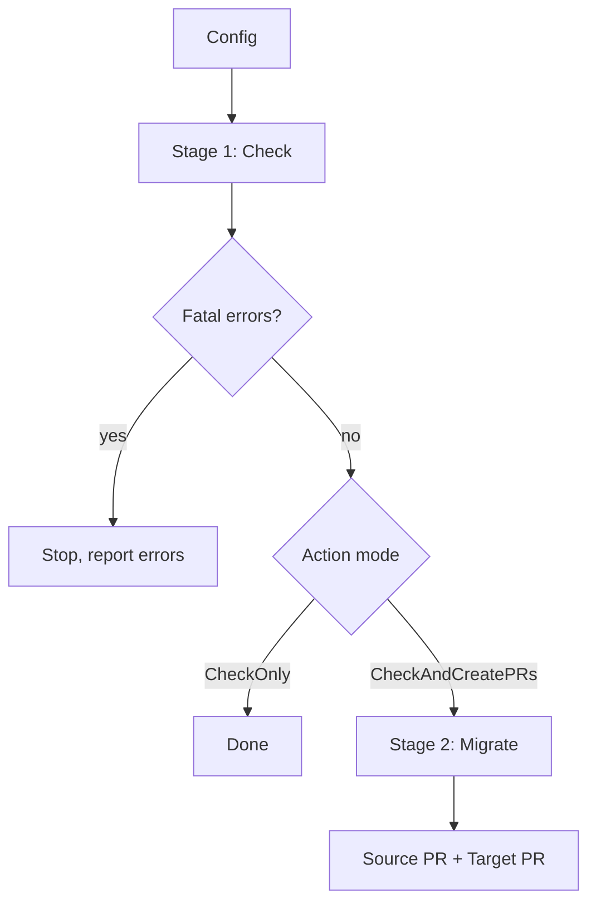
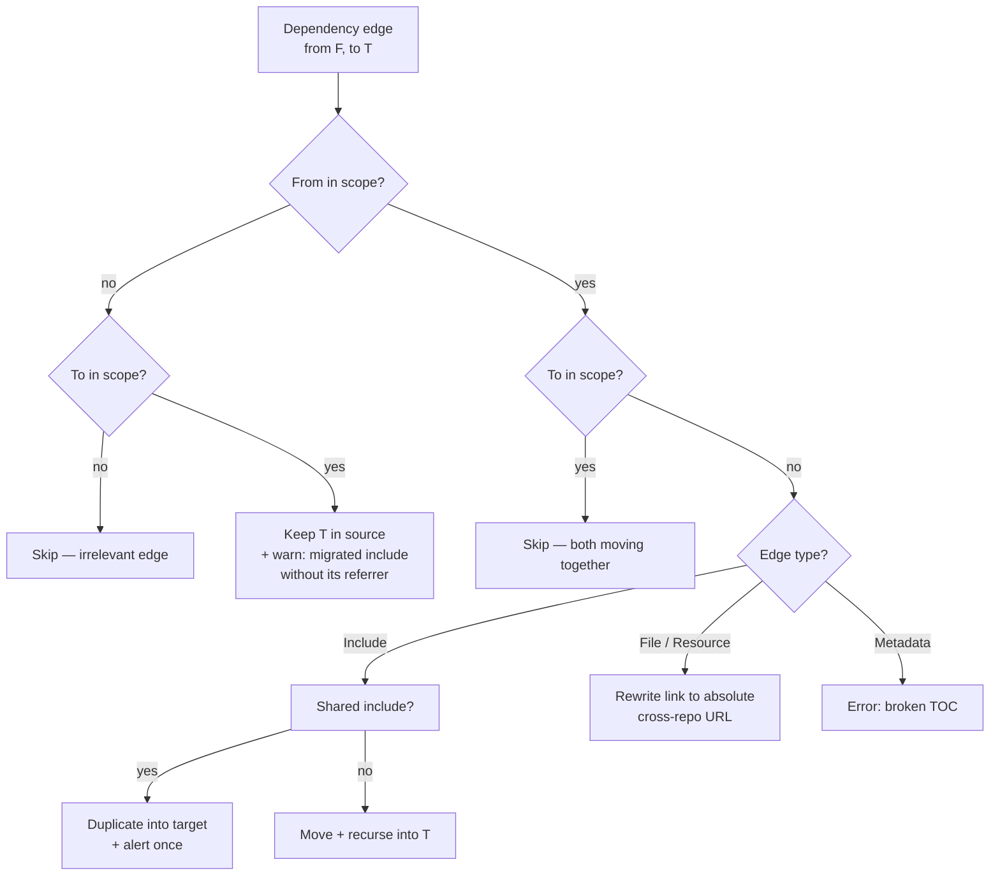
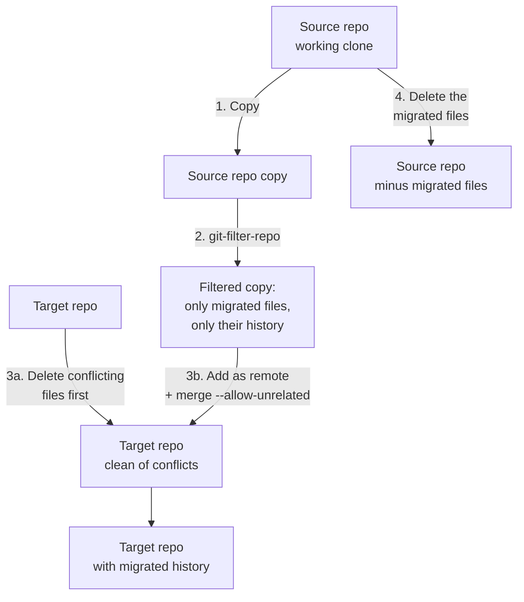

[`MicrosoftDocs/azure-docs`](https://github.com/MicrosoftDocs/azure-docs) is the public-facing repository behind a large
portion of Microsoft Learn. By late 2023 it had grown past **20 GB**.
A `git clone` could take many minutes on a good connection, fail outright
on a flaky one, and every server-side build accrued the same latency on
every job. Author productivity and CI throughput both suffered.

The obvious answer — *"split it into smaller repos"* — is one of those
ideas that sounds easy until you start writing it down. This is the story
of the tool we built to make it actually possible: **migrate-repo-content**.

## The constraints that shaped the design

Three constraints made a one-shot split impossible.

**1. No flag day.** `azure-docs` hosts content for hundreds of product
areas owned by independent service teams. Cutting them all over in one
move was a non-starter — coordination cost alone would have killed it.
Teams needed to peel off when *they* were ready, one product area at
a time.

**2. Content is a graph, not a tree.** A Markdown file isn't standalone.
It links to siblings, includes shared snippets, sits under a TOC,
references a breadcrumb config, has a stable per-file document ID for
analytics, and may be the target of redirection rules elsewhere in the
repo. Moving the file is the easy 10%; preserving all the edges is the
hard 90%.

**3. Shared content has no obvious home.** Some assets are referenced
from many product areas. For each one we had to decide between:

- **Isolate** — rewrite a relative link as an absolute cross-repo link, so the target keeps referring back to the shared copy in the source.
- **Duplicate** — copy a shared include into the target so both repos own a copy.
- **Extract** — move it out to a third shared repo *before* the migration runs.

Different answers for different content types.

These constraints pushed us toward a **reusable, two-stage tool** that
any team could point at any source/target pair, repeatedly, as the split
rolled out over months.

## What "content is a graph" actually means

The graph claim deserves more than one sentence, because every design
decision later in this post is a response to a specific shape this
graph can take. Two small examples make it concrete.

### Example 1: a shared include

Say `articles/some-feature.md` is part of the migration set for a
product team moving out of `azure-docs`. It contains:

```markdown
[!INCLUDE [prereq-cli-login](../includes/prereq-cli-login.md)]
```

That include file lives at `includes/prereq-cli-login.md`, which is
*outside* the migration set. And it's not just this team that uses it —
imagine dozens of other product areas across `azure-docs` reference the
same snippet.

So: when this team moves to its own repo, what happens to this include?

- **Move it with the team** → breaks the other product areas that
  still reference it.
- **Leave it in `azure-docs`** → the new repo can't find it, the page
  breaks.
- **Rewrite the include path to an absolute cross-repo reference** →
  works, but introduces a hard dependency from the new repo back into
  `azure-docs`. Every build now has to clone two repos.
- **Duplicate it into the new repo** → the new repo is self-contained,
  but now two copies of the same snippet exist. If the snippet is
  updated in `azure-docs` later, the duplicate goes stale silently.
- **Extract it to a new shared-content repo before migrating** →
  cleanest long-term, but blocks every migration on a coordination
  step.

There's no universal right answer. The tool can't decide *for* you, but
it can detect the situation, classify it, and warn loudly so the team
makes a deliberate choice. That's where Stage 1's "alert once per
shared resource" behavior earns its keep.

### Example 2: a link across the boundary

Inside `articles/some-feature.md`:

```markdown
For VM monitoring, see [this guide](../virtual-machines/monitoring.md).
```

`virtual-machines/monitoring.md` is *not* in the migration set —
the VM team isn't ready to move yet. After the migration:

- The link is a relative path. It used to resolve inside `azure-docs`,
  but the file `some-feature.md` now lives in a different repo. The
  link points to nothing.
- The fix is to rewrite it to its *published URL* on Microsoft Learn
  (`https://learn.microsoft.com/azure/virtual-machines/monitoring`), so
  the link still works against the live site regardless of which repo
  the source lives in.
- But what if the link goes the other way — from a file *staying* in
  `azure-docs` to a file being *migrated* out? Now the source-side
  file's relative link breaks, and the same rewrite-to-absolute-URL
  fix has to happen *in the source repo* too.
- And what if both ends of the link are in the migration set? Leave
  the relative link alone — it'll resolve fine in the new repo.

Same edge, four different correct behaviors depending on which side
of the boundary each endpoint sits on. Multiply that by the half-dozen
edge types docfx tracks (includes, links, TOC ownership, breadcrumb
parents, xref, redirection targets…), and the combinatorial space gets
real quickly.

### Why this matters for the rest of the post

The migration set is a few hundred files. The set of *edges touching*
those files is tens of thousands. Most migrations are a 5–20 minute
analysis problem and a 30-second execution problem — the asymmetry is
where all the design lives. The tool's two-stage shape, the
edge-classification analyzer, the per-concern commits, the
duplicate-and-swap history rewrite — every one of those choices traces
back to "the graph is bigger than the file list, and the rules for each
edge depend on which side of the boundary its endpoints sit on."

## Two stages: Check, then Migrate

The tool runs in two phases driven by a single config file:



### Stage 1 — Check

The Check stage is **read-only** by design — it doesn't touch either
repo's working tree. It runs a series of validators in order of
increasing cost:

1. **Configuration validation.** Source and target must share the same
   docset base path, both repos must be reachable, the directories being
   migrated must exist, etc. These are cheap and run first to short-circuit
   obvious mistakes.
2. **Build output analysis.** The tool fetches the latest successful
   build artifacts for both repos (publish manifests, dependency maps,
   redirection state). This is what lets us reason about the content
   *graph* rather than just files on disk.
3. **Change planning.** An analyzer walks the migration set and
   produces a *change manifest* — every file move, link rewrite,
   breadcrumb change, redirection update, and shared-include duplication
   that the migration *would* perform.
4. **Pre-migration warnings.** A pre-flight checker runs over the manifest
   and emits warnings the user should see before pulling the trigger:
   - "This shared include will be duplicated in the target repo."
   - "TOC `foo/TOC.yml` references a file outside the migration scope —
     it will appear broken after the split."
   - "These redirection rules will be moved to the target repo's
     `.openpublishing.redirection.json`."

If `Action: CheckOnly`, the tool stops here and the team reviews the
report. If `Action: CheckAndCreatePRs`, the same manifest
becomes the input to Stage 2 — no re-analysis, no drift between what
was reviewed and what will be applied.

### Stage 2 — Migrate

Migrate is the destructive phase, but the destruction is structured.
The pipeline runs in a fixed order: first the file-level operation that
needs git history rewriting, then a sequence of content-level
transformers that each own a single concern, then PR creation.

1. **File migrator** — runs [`git-filter-repo`](https://github.com/newren/git-filter-repo) to rewrite history (deep dive below).
2. **Redirection step** — partitions `.openpublishing.redirection.json` between the two repos.
3. **Link fixer** — rewrites in-repo links that now cross the repo boundary.
4. **Publish-config step** — copies the relevant `.openpublishing.publish.config.json` entries into the target.
5. **Docfx-config step** — merges docfx config (xref, file mappings, metadata, groups) into the target docset.
6. **Document-ID step** — preserves stable per-file document IDs so analytics and inbound links survive.
7. **Breadcrumb step** — moves the relevant breadcrumb config into the target.
8. **PR creator** — opens the source and target pull requests.

Each step runs in sequence and **owns its own commit** on both
repos. In pseudo-code:

```text
linkFixer.run()         => commit "Fix links"
breadcrumbStep.run()    => commit "Migrate breadcrumbs"
docfxConfigStep.run()   => commit "Migrate docfx config"
# …and so on for every step
```

The output is **two pull requests** — one against the source repo
(removing the migrated content) and one against the target (adding it,
along with config and shared assets). Each PR contains commits
partitioned by concern, one per step: *Remove files*, *Fix links*,
*Migrate breadcrumbs*, *Migrate docfx config*, *Migrate publish config*,
*Migrate document IDs*, and so on. A reviewer who is an expert on, say,
the docfx config can scan that one commit in isolation. This turned out
to be a huge unblocker for getting PRs merged quickly — the alternative
(one giant squashed commit with thousands of changed files) had a long
queue of reviewer eyes.

Two parts of this pipeline are worth zooming in on, because they're
where the interesting design lives.

### Deep dive 1: walking the content graph

Before any file moves, the Check stage has to answer one question for
every dependency edge in the repo: *given that the user is migrating
directories X and Y, what should happen to this edge?* The answer
drives everything downstream — what gets moved, what gets duplicated,
what becomes a cross-repo link, what's an error.

The repo's dependency graph is pre-computed by [docfx](https://github.com/dotnet/docfx)
and shipped as `.dependencymap.json`. Edges come typed:
`Include` (Markdown include), `File` (a link/reference), `Metadata`
(TOC ownership), plus a handful of others. The interesting structure
isn't a tree — files can pull each other in cycles, and a single
shared include can be referenced from a hundred different product
areas.

The dependency analyzer walks this graph with three rules:



A few patterns worth calling out:

**Edge classification first.** Rather than a giant switch on file
type, the analyzer first classifies the *edge* along three axes, then
dispatches:

| Axis | Values |
|---|---|
| Where is `from`? | in scope &nbsp; • &nbsp; out of scope |
| Where is `to`?   | in scope &nbsp; • &nbsp; out of scope |
| What kind of edge? | Include &nbsp; • &nbsp; File / Resource &nbsp; • &nbsp; Metadata &nbsp; • &nbsp; … |

A small number of (from, to, type) combinations cover every behavior
the tool needs. This makes the rules easy to reason about case by case,
and it makes the test specs — one YAML block per combination — map
cleanly onto code paths.

**Two-phase traversal for include edges.** The diagram above shows the
classification for a single edge, but includes get an extra wrinkle:
moving an included file can pull *its own* dependencies into the
migration set, expanding the scope recursively. To keep this from
interleaving with non-include processing, includes are walked first
in their own pass, the scope set is allowed to settle, and only then
do non-include edges get classified. This avoids a class of bugs where
a non-include edge fires before the recursive expansion has finished.

**Cycle and re-entry prevention via a traversal context.** A small
mutable context object tracks which edges have been handled, which
extra files have been pulled into scope by recursive include expansion,
and which files have already been copied to the target. Every traversal
step checks this context before recursing. Without it the analyzer
would loop forever on the first include cycle.

**Alert-only-once for shared resources.** Shared includes and resources
are noisy by nature — a single shared snippet might appear in 50
warnings if treated naively. A tiny helper handles this in one place:

```text
report_once(error, key, seen_keys):
    if key in seen_keys: return
    seen_keys.add(key)
    errors.append(error)
```

Each "warning category" gets its own set of seen keys. The result is
that the user sees one warning per shared asset, not one per *reference
to* that asset. A small UX detail that turned the error report from
unreadable to actionable.

### Deep dive 2: history rewriting without touching the source repo

The most consequential step in Migrate is the first one. It replays
only the migration-scope commits onto the target repo, so that
`git blame` and `git log` keep working for moved files — authors see
continuous history. The naive way to do this — run `git-filter-repo`
directly on the source repo — is dangerous, because `git-filter-repo`
*rewrites history in place*. One mistake and the original source clone
is unusable.

The actual flow is four steps (with two sub-steps in the middle):



1. **Duplicate the source repo.** The destructive history rewrite
   happens on a *copy*. The original source-repo clone stays pristine
   until step 4, when it just needs simple file deletions.
2. **Filter the copy.** `git-filter-repo` strips the copy down to only
   the directories and files in the migration set, preserving the full
   commit history for those paths.
3. **Merge into the target.** Before the merge, any pre-existing files
   in the target that would conflict are deleted in a separate commit.
   Then the filtered copy is added as a local git remote and merged
   with `--allow-unrelated-histories`, so the merge itself is clean.
4. **Delete from the original source.** Only after the target side has
   been successfully populated does the tool touch the original source
   working tree — and only with plain file deletes, no history
   rewriting.

A consequence worth being explicit about: **the on-disk size of
`azure-docs` does not shrink after a migration.** That's deliberate.

- The deleted files are still in git history — only the working tree
  loses them.
- The source repo's active contributors keep working as if nothing
  happened: clones still work, `git blame` still resolves, no risky
  history rewrite on a repo that hundreds of people commit to every
  day.
- The size win lands on the *target* side: any team that moves out now
  has a brand-new small repo to work in.
- Over time, as more areas move out, `azure-docs` stops *growing* as
  fast. Full size reclamation, if ever needed, becomes a separate
  one-shot project — decoupled from the migration tool.

This shape — *operate on a duplicate, verify it, then commit the small
destructive step to the real thing* — shows up everywhere:

- Database migration tools doing "shadow writes" before the cutover.
- Build systems writing artifacts to a staging directory before
  swapping symlinks.
- Blue/green deploys.

Worth reaching for whenever your destructive operation has a long tail
of ways to go wrong. The copy is a free rollback: just delete it and
start over.

#### A fun aside: the "10,000 file limit" that wasn't

Early in the project, someone reported that the tool seemed to cap out
at migrating 10,000 files in a single run — files past that count
"didn't appear" in the resulting PR.

We chased it as a bug in the tool for a while before realizing:

- The file count was fine.
- The commit count was fine.
- `git log` saw everything.
- **GitHub's UI for the Commits tab** simply stops paginating past
  10,000 commits.

Documented (eventually) [here](https://github.com/github/docs/pull/32296/files).
A useful reminder: when a tool you're building hits a strange ceiling,
the ceiling might live in something downstream that you weren't even
thinking about.

### Redirection: a small but important detail

One choice worth highlighting: the tool also **splits the redirection
ruleset** between the two repos. The source repo's
`.openpublishing.redirection.json` is partitioned so rules pointing at
migrated paths follow the content into the target. Without this, links
that worked yesterday would 404 today — which for a docs site with
millions of inbound links from search engines and bookmarks is a
serious regression.

### Breadcrumbs: a step that was added after launch

The initial design didn't include the breadcrumb step. Breadcrumbs were
marked out-of-scope to ship the first version faster — teams could
hand-fix breadcrumb configs on their own, the thinking went.

Once teams started using the tool, that hand-fix step turned out to be
annoying enough to be worth automating. Adding it took a day:

- A new analyzer for Stage 1.
- A new pre-flight check for the warning report.
- A new migrator step with its own commit in Stage 2.
- Nothing else had to move.

That's the property you actually want from a pipeline of this shape,
and it was reassuring to see it pay off the first time we needed it.
The breadcrumb step is now indistinguishable from the steps that were
there day one — which is the test.

## Tests: readable specs, 92% coverage

The test suite turned out to be the most interesting design problem in
the project. We used [yunit](https://github.com/docascode/yunit) — a
readable-spec testing framework where each test case is a YAML document
describing *inputs* (mock repo state, mock build outputs) and expected
*outputs* (target repo file contents, emitted errors).

A typical case from `dependency.yml`:

```yaml
---
# TOC referencing a file outside the migration scope — should error
input:
  workingDirectory:
    source/build-package/to-migrate/.dependencymap.json: |
      { "dependencies": {
          "a/TOC.yml": [
            { "source": "articles/file-toced-outside.md", "type": "file" }
          ]
        }
      }
  sourceRepo:
    to-migrate/a/TOC.yml: |
      - name: File toced outside
        href: articles/file-toced-inside.md
    to-migrate/articles/file-toced-outside.md: t
output:
  errors: |
    {"message_severity":"error","code":"toc-dependency-broken","message":"TOC references a file outside the migration scope"}
---
```

Each `---`-separated block is a self-contained test. A reviewer can
read a spec file end-to-end and understand *what the tool guarantees*
without ever opening the source — **the spec IS the contract**.

The project hit **92% line coverage** at the time, which was unusually
high in our org then, and from what I've seen still notable today.
Coverage isn't the point on its own. The point is the mechanism:

- yunit specs are cheap to add.
- Fixing a bug almost always came with a new YAML block reproducing
  it.
- Coverage was a side effect, not a goal.

The lesson held up surprisingly well in 2026, after the cost of writing
a test case dropped to roughly zero — but inverted:

- **Then**: the win was a framework that made the *human cost* of
  writing a test near-zero.
- **Now**: the framework also has to make the *AI cost* of *reading
  and trusting* a generated test near-zero. AI can produce 100 cases
  in a minute; a human still has to skim them.

Declarative spec files happen to be ideal for both readers.

### The fixture got a base layer

Early on, every spec file repeated a chunk of boilerplate — the same
mock repo skeleton, the same minimal `.dependencymap.json`, the same
docset config — just so each case had a runnable baseline. The noise
made the actual difference being tested harder to see.

The fix:

- Extract the common pieces into a **base fixture** every spec
  automatically inherits.
- Each YAML case declares only what's *different* from the base.
- For the unusual case that needs the base to *not* include something,
  the spec declares a removal and the framework strips it before
  running.

Result: most specs went from 30–40 lines of mostly-shared setup to
5–10 lines of pure intent. Reviewing a new test case became a matter
of reading what *this* scenario adds — exactly the property that made
spec-style testing worth doing in the first place.

## Closing

Three things I'd do exactly the same if I were starting over:

- Two stages with the same manifest threading through both. The split
  between "decide what to do" and "do it" is what let teams build
  trust in the tool before letting it touch their repos.
- One commit per concern. Made PR review tractable.
- Spec-style tests. Cheap to add, cheap to read.

The repo split itself is well underway:

- Product areas that moved out clone in seconds.
- CI runs faster on the smaller repos.
- Each team owns its content in a focused repo.
- `azure-docs` itself is smaller in *active surface area* — fewer
  live files, fewer cross-team merge conflicts — even though its git
  history (and on-disk size) is unchanged by design.

None of this was visible from a single PR. It was the cumulative
effect of every team being *able* to move when they were ready, because
the tool made it safe.

If there's a single takeaway: when you're refactoring something
load-bearing, **separate the planning from the doing** and make the
plan reviewable. The whole design of migrate-repo-content falls out of
that one principle.
