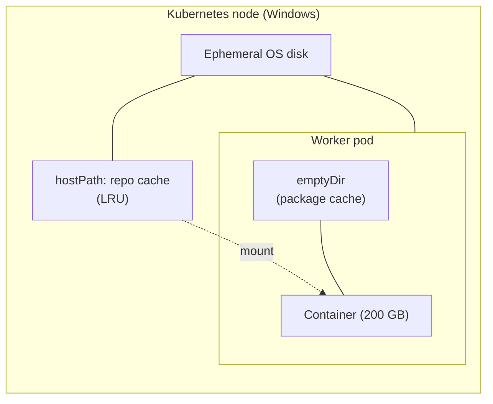

This is the story of an Azure Kubernetes Service (AKS) cluster that
ended up shaped almost entirely around one resource — *disk* — and
the iterative design it took to get there. The cluster runs the
build workers for the publishing platform behind
[learn.microsoft.com](https://learn.microsoft.com): the system that
takes a content change in a source repository and turns it into the
pages people read.

## The problem

Some of the repositories this platform builds are *large*. The
monorepo I wrote about in
[the previous post]()
had grown past 20 GB before we split it, and several of its siblings
aren't far behind. A `git clone` of that kind of repo takes minutes
on a good connection, and that minute-or-more shows up in two
user-visible places:

- **Publish latency.** When a change merges, how long until the
  updated page is live on the site.
- **The PR preview loop** — the more frequent and more painful one.
  An author pushes a commit to a PR, the platform builds a preview
  of what their change will look like once published, and they sit
  waiting for that preview before they can iterate. Every cold clone
  is friction the author feels directly.

Cloning the source repo is, by a wide margin, the largest single
time component of a build job. **Clone time is roughly linear in
repo size.** Fetch + checkout against an existing clone, by
contrast, is essentially constant time regardless of repo size —
git only transfers the deltas. So the moment a worker has a local
copy of a given repository, every future build for that repo *on
that node* is dramatically faster.

That single observation is the seed of everything that follows.
**Keeping repositories warm on local disk is what makes build
latency tolerable.** And keeping them warm means a *lot* of disk —
hundreds of GB per node, growing as the platform grows.

## What that does to the cluster shape

Once "cache repos on local disk" is the load-bearing design
decision, the rest of the cluster has to bend around it. The result
is an AKS cluster that doesn't look like most of the Kubernetes
material you'll find online, on three axes at once.

### 1. Queue-driven, not request-driven

Build workers don't sit behind an ingress. They subscribe to a
message queue. A content change emits an event; the event becomes a
message; an idle worker picks it up, runs the multi-step build
pipeline (clone, restore dependencies, transform, publish), and
waits for the next message.

Consequences:

- **HPA, but not on CPU or memory.** Scaling is driven by *queue
  depth* via [KEDA](https://keda.sh/), which exposes the queue as a
  scaling metric to the standard Horizontal Pod Autoscaler. There is
  no synchronous client waiting for a response, but there *is* an
  SLA: how long a message can sit in queue before someone notices
  their docs aren't updating.
- **Workers are long-running.** A single message can take seconds
  for a small change or many minutes for a full rebuild of a large
  repository. You can't treat a pod as a stateless request-handler
  you can kill anytime — killing it mid-build means the message
  either has to retry or the user sees a publishing failure.
- **No ingress, no service mesh, no sidecar story.** A whole
  category of "default" Kubernetes complexity simply doesn't apply.

### 2. Windows containers

The build worker itself runs on .NET Core today and could in
principle run on Linux. The containers stay on Windows for two
historical reasons that have outlived the original constraint:

- The build toolchain *began* on .NET Framework, which is
  Windows-only. The worker has since been ported to .NET Core, but
  the surrounding ecosystem of build steps and helper tools
  accumulated over years isn't all portable in the same way.
- The content pipeline relies on **case-insensitive path resolution**
  for relative links between Markdown files. That's the platform's
  contract with authors: a link that worked on a Windows filesystem
  shouldn't suddenly 404 because the underlying server cared about
  case. Switching to Linux would silently break a long tail of
  existing content.

So Windows containers it is. And Windows containers come with their
own footguns — most of them, as you'll see, are disk footguns.

### 3. Disk-bound, not CPU- or memory-bound

A typical web service is sized around CPU and memory; disk is
"whatever the host has." For this cluster it's the other way around.
Disk is the scarce resource, the one that determines hit rate, the
one that determines incident frequency, and — eventually — the one
that drove the design.

A few things make disk unusually load-bearing here:

- **The performance win is enormous.** With a warm cache, prepare
  time drops by ~75% on a representative job mix, and total job time
  by ~30%. For very large repositories, a warm cache shaves nearly a
  minute off the critical path.
- **Disk is a hard limit.** CPU saturation slows things down; memory
  saturation evicts pages. *Disk-full* on a build worker is
  catastrophic — the in-progress job errors out mid-write, the node
  needs to be re-imaged, and every other repo cached on that node
  is lost in the process.

The rest of this post is the history of us learning that lesson and
re-learning it as the platform grew.

## The disk model, one layer at a time

Here's the layout we ended up at, which the rest of this post
explains piece by piece.



Four layers, each with a different lifetime:

- **Ephemeral OS disk** — host-local SSD; replaced when the node is re-imaged.
- **hostPath repo cache** — survives pod restarts; LRU eviction, capped by repo count.
- **Container writable layer** — sized to 200 GB on Windows; dies with the pod.
- **emptyDir package cache** — pod-scoped scratch space; bounded by `ephemeral-storage` limits.

## The evolution

The path to that layout was fully linear — each phase solved one
problem and (in most cases) exposed the next.

1. **Ephemeral OS disk** — fixes slow I/O on managed disks.
2. **200 GB Windows container layer** — the 20 GB default isn't enough.
3. **`hostPath` for repo cache** — survives pod restarts; hit rate 41% → 63%.
4. **Pod affinity** — only worker pods that need the cache get scheduled where it lives.
5. **`emptyDir` + `ephemeral-storage`** — bound the pod's disk footprint.
6. **LRU eviction with a repo-count ceiling** — disks stop filling up.

### Phase 1: Ephemeral OS disk

We started on a default Azure VM disk configuration, where the OS
disk is backed by Azure Storage rather than the host machine. I/O
latency was noticeably worse than the older infrastructure the
service had migrated from, and the slowdown showed up directly in
build times — same CPU, same memory, same code, just slower disk.

We confirmed this by benchmarking with
[Iometer](https://www.iometer.org/) both inside a Windows container and
on the host VM directly. Both were slow, so the container wasn't the
culprit; the storage path was.

The fix was to switch to [**Ephemeral OS disks**](https://learn.microsoft.com/en-us/azure/virtual-machines/ephemeral-os-disks) — the OS disk sits on
the host machine's local SSD instead of Azure Storage. It's only
available on VM sizes that have local SSD (in the older
`Dv3`/`Dsv3` generation, that's `Dsv3` but not `Dv3`; newer
generations follow the same pattern), and the OS disk is lost when
the VM is deallocated — but for a stateless worker, that's exactly
the trade you want.

The lesson worth keeping: when your workload is sensitive to disk
latency, *which VM family* and *which OS disk type* are
performance-critical decisions, not bookkeeping ones.

### Phase 2: 200 GB Windows container layer

Windows containers have a quirk Linux containers don't share: the
container's writable layer has a **default size of 20 GB**. On Linux
the writable layer is generally bounded by the host filesystem.
On Windows, the storage driver imposes its own limit, and the
default is far too small for a workload that downloads multi-GB
repositories and toolchain caches.

The fix is a docker daemon setting that raises the default
writable-layer size for any container the daemon starts (it's not
a VM disk size — the VM's disk is already much larger):

```json
{
  "storage-opts": ["size=200GB"]
}
```

The annoying part is that this has to be set on the host VM at
startup, *before* the kubelet ever starts a container. We rolled it
out via [Custom Script Extension (CSE)](https://learn.microsoft.com/en-us/azure/virtual-machines/extensions/custom-script-windows)
and [Desired State Configuration (DSC)](https://learn.microsoft.com/en-us/powershell/dsc/overview)
during VM provisioning — not part of the day-to-day Kubernetes
workflow at all. If you don't get this right, your workers crash with
disk-full errors at small percentages of the node's actual capacity,
which is a deeply confusing failure mode the first time you see it.

### Phase 3: Put the repo cache on the node, not the pod

By default, anything written inside a container disappears when the
pod restarts. For us that meant the repo cache was being wiped on
every deployment — and we deploy often.

We measured the impact and the cache hit rate sat around **41%**,
roughly "we successfully reuse a clone for a bit less than half of
all builds." Tolerable, but well below what was achievable.

The fix was a `hostPath` volume. The repo cache moved from inside the
container to a directory on the host VM, mounted into the pod:

```yaml
volumes:
  - name: repo-cache
    hostPath:
      path: C:/RepoCache
      type: DirectoryOrCreate
containers:
  - image: ...
    volumeMounts:
      - name: repo-cache
        mountPath: C:/path/inside/container
```

`hostPath` is one of those features the Kubernetes documentation
warns you about — it ties the pod to a specific node, breaks
portability, and is generally a smell in stateless web-service
land. For us it was exactly right: the node *is* the cache, and the
worker pod is the cache *user*. The pod lifecycle and the cache
lifecycle are deliberately different.

Hit rate jumped from **41% to ~63%** after the change. With more
chance of a warm clone, authors' validation results came back roughly
50% faster on the affected paths.

### Phase 4: Pod affinity for cache-aware scheduling

`hostPath` ties a cache to a specific node, but by default the
scheduler has no idea that matters. Worker pods can land on any
node in the pool, which means after a few deployments the cache
"slots" get spread thin — many nodes hold a few cached repos
each, instead of a smaller number of nodes holding deep,
re-usable caches.

The fix was [pod affinity](https://kubernetes.io/docs/concepts/scheduling-eviction/assign-pod-node/#affinity-and-anti-affinity)
expressed in our Helm chart's worker template — worker pods are
scheduled with a *preference* for nodes that already host other
workers, so they bunch up on a smaller subset of nodes and the
caches on those nodes stay hot across deployments.

```yaml
affinity:
  podAffinity:
    preferredDuringSchedulingIgnoredDuringExecution:
      - weight: 100
        podAffinityTerm:
          labelSelector:
            matchExpressions:
              - key: app
                operator: In
                values: [build-worker]
          topologyKey: kubernetes.io/hostname
```

(The snippet assumes worker pods carry an `app: build-worker`
label set elsewhere in the chart.) Two things worth calling out:

- **`preferredDuringSchedulingIgnoredDuringExecution`** — "preferred"
  rather than "required." If we made it
  `requiredDuringSchedulingIgnoredDuringExecution`, a pod couldn't
  start at all when its preferred nodes were full, which is worse
  than starting on a cold node and rebuilding the cache. "Ignored
  during execution" means the rule is only consulted at scheduling
  time; once a pod is running, the scheduler doesn't move it.
- **`topologyKey: kubernetes.io/hostname`** — the "togetherness" we
  care about is *same node* (because that's where the `hostPath`
  cache lives), not same rack or same zone.

`hostPath` plus naive scheduling is a half-built feature.

### Phase 5: Bound the pod's disk use with emptyDir + ephemeral-storage

`hostPath` solved repo caching, but there's a second category of
cache that *shouldn't* outlive the pod: package caches, intermediate
build artifacts, scratch space the build tool keeps. Those grow
unboundedly per-pod and have no reuse value across pods.

For that we used `emptyDir` with explicit `ephemeral-storage`
requests and limits:

```yaml
volumes:
  - name: docfx-cache
    emptyDir: {}
containers:
  - image: ...
    volumeMounts:
      - name: docfx-cache
        mountPath: C:/path/to/.docfx
    resources:
      requests:
        ephemeral-storage: 160Gi
      limits:
        ephemeral-storage: 180Gi
```

The split between `hostPath` (survives pod restart, repo-cache
shape) and `emptyDir` (dies with the pod, scratch-space shape) is
worth internalizing. They look like the same Kubernetes feature
from one angle — "a directory mounted into a container" — but they
encode opposite lifetime promises. Mixing them up means either
losing data you wanted to keep or hoarding data you wanted to
throw away.

### Phase 6: LRU eviction with a hard ceiling

For a long time the cache was deliberately unbounded — every repo we
cloned, we kept. As the platform grew, nodes started filling up;
disk-full triggered automatic node re-imaging, which went from a
benign occasional event to a frequent incident driver.

The fix was an LRU policy with a **hard ceiling on the *number* of
cached repositories** — a count rather than a byte-size, to keep the
implementation trivial (a counter against a constant is hard to get
wrong; tracking on-disk bytes across concurrent writes is not). The
ceiling sits well below disk capacity, so disk-full can't happen by
construction.

Telemetry showed a Zipfian pattern — a small hot set, a long cold
tail. We picked the count by replaying real traffic logs against
candidate ceilings. The chosen point cached **roughly half as many
repos** as the unbounded baseline while **retaining ~93% of its hit
rate** — a small, expected drop in exchange for a hard guarantee
against disk-full, and node re-image churn eliminated as a side
effect.

## What I'd tell someone walking into a similar cluster

Three things this evolution made permanent in my head.

**1. The default Kubernetes assumptions don't apply uniformly.**
Queue-driven, long-running, disk-bound workers on Windows
containers are a real shape of workload, but almost no
documentation, blog post, or training material is written for them.
Expect to spend more time reading the *features* of Kubernetes
carefully — `hostPath`, `emptyDir`, `ephemeral-storage`,
storage drivers, node pools — and less time reaching for
turnkey patterns that mostly target the web-service shape.

**2. On Windows containers specifically, budget time for the disk
plumbing.** The 20 GB default writable layer, the `storage-opts`
configuration, getting that configuration onto VMs at startup via
CSE/DSC — none of this is hard, but none of it is on the happy
path either, and you can lose a week to it if you treat it as a
last-minute detail.

**3. Old sizing decisions don't age with the platform.** The LRU
redesign wasn't algorithmically novel — LRU has been in textbooks for
fifty years. What was non-obvious was that the *aggressive caching
decision*, made years earlier and correct when made, had quietly
stopped being correct as the platform grew. It kept working in the
sense that nothing was throwing errors; it stopped working in the
sense that the unbounded growth model the original sizing assumed
no longer matched reality. The hardest part of the work wasn't
writing the eviction policy; it was noticing the policy needed to
exist at all.
